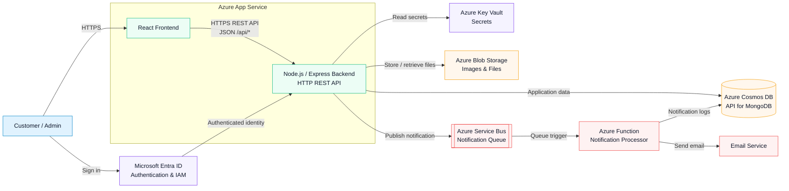

# KubeCart High-Level Application Architecture

## Request Flow

1. The user signs in through Microsoft Entra ID.
2. The React frontend communicates with the Node.js/Express backend using
   HTTPS REST API requests and JSON responses.
3. The backend stores application data in Cosmos DB using the MongoDB API and
   uses Blob Storage for images and files.
4. Order notifications are published to Service Bus and processed
   asynchronously by an Azure Function.
