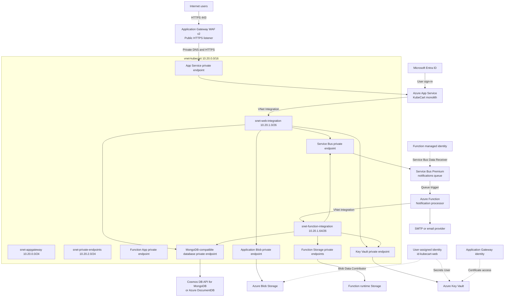

# KubeCart Private Azure PaaS Deployment Plan

## 1. Requirements captured by this document

This runbook implements the following target:

1. KubeCart runs as a monolithic Node.js and React application in Azure App
   Service.
2. Microsoft Entra ID and App Service Authentication replace local passwords
   and JWT authentication.
3. Azure Service Bus is used only for notification messages.
4. An Azure Function processes notification messages from the Service Bus
   queue.
5. Azure Key Vault stores secrets and credentials.
6. Azure Blob Storage stores product images, uploaded files, invoices, exports,
   and other object data.
7. Azure PaaS data-plane services use private endpoints.
8. App Service uses a user-assigned managed identity.
9. The App Service user-assigned identity receives only:
   - `Key Vault Secrets User`
   - `Storage Blob Data Contributor`
10. Public access is disabled only after private DNS and application
    connectivity have been tested.

## 2. Important architecture corrections

### Blob Storage does not replace the application database

Blob Storage is designed for files and object data. Do not store transactional
cart, inventory, profile, and order records as independent JSON blobs.

Use the MongoDB-compatible database for:

- Products and inventory metadata
- Shopping carts
- Orders
- User profiles
- Notification logs

Use Blob Storage for:

- Product images
- User uploads
- Generated invoices
- Reports and exports
- Large JSON export files
- Other binary or immutable objects

Store the blob URL, blob name, or container/blob path in the database record.

### The App Service must still send notifications

The App Service cannot publish a notification while having no authorization to
Service Bus.

To preserve the requirement that the App Service user-assigned identity has
roles only on Key Vault and Blob Storage, this plan uses:

- A Send-only Service Bus shared access policy.
- Its connection string stored as a Key Vault secret.
- A Key Vault reference exposed to the application as
  `SERVICE_BUS_CONNECTION_STRING`.

The user-assigned identity itself is not assigned a Service Bus role.

If a future security policy requires passwordless Service Bus access, create a
second user-assigned identity and grant only `Azure Service Bus Data Sender`.
Do not add that role to the Blob and Key Vault identity.

### Private endpoints protect data-plane traffic

Microsoft Entra ID and Azure Resource Manager are control-plane services and do
not become private endpoints in this design. The VNet-integrated applications
must still reach Microsoft Entra ID token endpoints and required Azure platform
endpoints.

Application Gateway is the intentional public entry point. All backend PaaS
data-plane services are private.

## 3. Target architecture



## 4. Suggested resource names

Replace `<unique>` with a globally unique value.

| Resource | Suggested name |
|---|---|
| Resource group | `rg-kubecart-prod` |
| Virtual network | `vnet-kubecart` |
| Application Gateway | `agw-kubecart` |
| Public IP | `pip-agw-kubecart` |
| App Service plan | `asp-kubecart-pv3` |
| App Service | `app-kubecart-<unique>` |
| Function Premium plan | `plan-kubecart-functions-ep1` |
| Function App | `func-kubecart-notify-<unique>` |
| Application storage | `stkubecartdata<unique>` |
| Function storage | `stkubecartfunc<unique>` |
| Key Vault | `kv-kubecart-<unique>` |
| Service Bus namespace | `sb-kubecart-<unique>` |
| Service Bus queue | `notifications` |
| Database account | `cosmos-kubecart-<unique>` |
| App Service identity | `id-kubecart-web` |
| Function identity | `id-kubecart-function` |
| Application Gateway identity | `id-kubecart-gateway` |

Use one Azure region for the VNet, private endpoints, App Service, Function App,
Storage, Service Bus, Key Vault, and database.

## 5. Required service tiers

Use tiers that support the required networking features:

| Service | Recommended tier |
|---|---|
| Application Gateway | WAF_v2 |
| App Service | Premium v3 |
| Azure Functions | Elastic Premium EP1 |
| Service Bus | Premium |
| Storage | General-purpose v2 |
| Key Vault | Standard or Premium |
| Database | A MongoDB-compatible Azure tier supporting Private Link |

Service Bus private endpoints require the Premium tier.

Elastic Premium is selected for the Function App because it supports VNet
integration, private endpoints, and secured runtime storage.

## 6. Create the resource group

1. Sign in to `https://portal.azure.com`.
2. Search for **Resource groups**.
3. Select **Create**.
4. Select the subscription.
5. Enter `rg-kubecart-prod`.
6. Select the deployment region.
7. Select **Review + create**.
8. Select **Create**.

## 7. Create the virtual network and subnets

1. Search for **Virtual networks**.
2. Select **Create**.
3. Use:
   - Name: `vnet-kubecart`
   - Address space: `10.20.0.0/16`
4. Create these subnets:

| Subnet | Address range | Purpose |
|---|---|---|
| `snet-appgateway` | `10.20.0.0/24` | Application Gateway only |
| `snet-web-integration` | `10.20.1.0/26` | App Service outbound VNet integration |
| `snet-function-integration` | `10.20.1.64/26` | Function outbound VNet integration |
| `snet-private-endpoints` | `10.20.2.0/24` | Private endpoint network interfaces |
| `snet-management` | `10.20.3.0/27` | Optional private deployment runner or test VM |

5. Delegate `snet-web-integration` to `Microsoft.Web/serverFarms`.
6. Delegate `snet-function-integration` to `Microsoft.Web/serverFarms`.
7. Do not delegate `snet-private-endpoints`.
8. Do not place VNet integration and private endpoints in the same subnet.
9. Keep `snet-appgateway` dedicated to Application Gateway.

### Why separate subnets are required

The App Service private endpoint handles inbound traffic to the app.

App Service VNet integration handles outbound traffic from the app to Key
Vault, Blob Storage, Service Bus, and the database.

These are different features and cannot share the same subnet.

## 8. Create and link private DNS zones

Open **Private DNS zones** and create the following zones:

| Azure service | Private DNS zone |
|---|---|
| App Service and Function App | `privatelink.azurewebsites.net` |
| Key Vault | `privatelink.vaultcore.azure.net` |
| Blob Storage | `privatelink.blob.core.windows.net` |
| Azure Files | `privatelink.file.core.windows.net` |
| Queue Storage | `privatelink.queue.core.windows.net` |
| Table Storage | `privatelink.table.core.windows.net` |
| Service Bus | `privatelink.servicebus.windows.net` |
| Cosmos DB API for MongoDB | `privatelink.mongo.cosmos.azure.com` |

For each zone:

1. Open the private DNS zone.
2. Select **Virtual network links**.
3. Select **Add**.
4. Select `vnet-kubecart`.
5. Keep auto-registration disabled.
6. Save the link.

When each private endpoint is created, select:

- **Integrate with private DNS zone**: `Yes`
- The existing matching private DNS zone

Use the normal service hostname in application settings. Do not configure the
application with a `privatelink` URL.

For example, use:

```text
https://stkubecartdata<unique>.blob.core.windows.net
```

DNS inside the VNet converts that normal hostname to the private endpoint IP.

## 9. Create the App Service user-assigned identity

1. Search for **Managed Identities**.
2. Select **Create**.
3. Use:
   - Name: `id-kubecart-web`
   - Resource group: `rg-kubecart-prod`
   - Region: the application region
4. Create the identity.
5. Record:
   - Client ID
   - Object or principal ID
   - Resource ID

Do not grant permissions yet. Permissions are assigned after Key Vault and Blob
Storage exist.

## 10. Create the application Blob Storage account

Create a dedicated storage account for application object data.

1. Search for **Storage accounts**.
2. Select **Create**.
3. Use:
   - Name: `stkubecartdata<unique>`
   - Performance: `Standard`
   - Redundancy: `ZRS` when supported, otherwise `LRS` for a lab
   - Account kind: `StorageV2`
4. On **Advanced**:
   - Require secure transfer: `Enabled`
   - Minimum TLS version: `1.2`
   - Allow Blob anonymous access: `Disabled`
   - Allow storage account key access: disable after managed identity testing
5. Initially leave public network access enabled for creation and testing.
6. Create the account.

Create private containers:

- `product-images`
- `user-uploads`
- `invoices`
- `exports`

For every container, set public access level to **Private**.

### Create the Blob private endpoint

1. Open the storage account.
2. Select **Networking**.
3. Select **Private endpoint connections**.
4. Select **+ Private endpoint**.
5. Select `vnet-kubecart`.
6. Select `snet-private-endpoints`.
7. Select target subresource `blob`.
8. Integrate with `privatelink.blob.core.windows.net`.
9. Create the private endpoint.

Do not disable public access yet.

## 11. Grant Blob access to the App Service identity

Use container scope when possible.

For each application container:

1. Open the container.
2. Select **Access Control (IAM)**.
3. Select **Add role assignment**.
4. Select `Storage Blob Data Contributor`.
5. Select **Managed identity**.
6. Select the user-assigned identity `id-kubecart-web`.
7. Complete the role assignment.

Do not assign:

- Owner
- Contributor
- Storage Account Contributor
- Storage Blob Data Owner

`Storage Blob Data Contributor` is sufficient for reading, writing, and
deleting application blobs.

## 12. Create Key Vault

1. Search for **Key vaults**.
2. Select **Create**.
3. Use:
   - Name: `kv-kubecart-<unique>`
   - Permission model: `Azure role-based access control`
   - Soft delete: enabled
   - Purge protection: enabled
4. Initially leave public network access enabled.
5. Create the vault.

### Create the Key Vault private endpoint

1. Open Key Vault.
2. Select **Networking**.
3. Open **Private endpoint connections**.
4. Select **Create**.
5. Select `vnet-kubecart`.
6. Select `snet-private-endpoints`.
7. Select target subresource `vault`.
8. Integrate with `privatelink.vaultcore.azure.net`.
9. Create the endpoint.

### Grant Key Vault access to the App Service identity

1. Open Key Vault.
2. Select **Access control (IAM)**.
3. Select **Add role assignment**.
4. Select `Key Vault Secrets User`.
5. Select `id-kubecart-web`.
6. Complete the assignment.

This role reads secret values. It does not allow the application to create,
delete, or manage secrets.

Grant an administrator or deployment identity `Key Vault Secrets Officer` to
create and rotate secrets.

## 13. Create the MongoDB-compatible database

Use Azure Cosmos DB API for MongoDB or Azure DocumentDB with Private Link
support and a Mongoose-compatible connection string.

1. Create the database account in `rg-kubecart-prod`.
2. Create or select the `kubecart` database.
3. Record the complete MongoDB connection string.
4. Create a private endpoint from the database networking page.
5. Select `snet-private-endpoints`.
6. Integrate with the private DNS zone selected by the portal.
7. For Cosmos DB API for MongoDB, verify that the private DNS record is in
   `privatelink.mongo.cosmos.azure.com`.
8. Keep public access temporarily enabled until the App Service and Function
   connect successfully.

Store the connection string in Key Vault:

```text
Secret name: mongo-uri
Secret value: <complete MongoDB connection string>
```

Do not place the database password directly in App Service settings.

## 14. Create Service Bus Premium and the notification queue

1. Search for **Service Bus**.
2. Select **Create**.
3. Use:
   - Namespace: `sb-kubecart-<unique>`
   - Pricing tier: `Premium`
   - Region: the application region
4. Create the namespace.
5. Open **Queues**.
6. Create `notifications`.
7. Configure:
   - Max delivery count: `10`
   - Dead lettering on message expiration: enabled
   - Duplicate detection: optional but recommended

Do not create queues for products, carts, orders, or profiles.

### Create the Service Bus private endpoint

1. Open the Service Bus namespace.
2. Select **Networking**.
3. Select **Private endpoint connections**.
4. Create a private endpoint in `snet-private-endpoints`.
5. Select target subresource `namespace`.
6. Integrate with `privatelink.servicebus.windows.net`.
7. Keep public network access enabled until both producers and consumers work.

### Create the App Service Send-only credential

1. Open **Shared access policies**.
2. Select **Add**.
3. Name the policy `kubecart-app-send`.
4. Enable only `Send`.
5. Do not enable `Listen` or `Manage`.
6. Copy the primary connection string.
7. Store it in Key Vault:

```text
Secret name: servicebus-sender-connection
Secret value: <Send-only Service Bus connection string>
```

The App Service user-assigned identity still has no Service Bus role.

## 15. Create the Function runtime storage account

Use a separate account for the Azure Functions runtime.

1. Create `stkubecartfunc<unique>`.
2. Use General-purpose v2.
3. Require secure transfer.
4. Use minimum TLS 1.2.
5. Create the account before creating the Function App.

Create private endpoints for:

- `blob`
- `file`
- `table`
- `queue`

Connect each endpoint to `snet-private-endpoints` and the matching private DNS
zone.

The Function runtime can require Blob, File, and Table endpoints. Queue is also
required for Durable Functions and is recommended for future compatibility.

Do not disable public access until the Function App has VNet integration and
can start successfully.

## 16. Create the Function identity

Create `id-kubecart-function`.

Assign only the roles required by the Function:

| Scope | Role |
|---|---|
| Service Bus `notifications` queue or namespace | `Azure Service Bus Data Receiver` |
| Key Vault | `Key Vault Secrets User` |
| Function storage | `Storage Blob Data Owner` |
| Function storage | `Storage Queue Data Contributor` |
| Function storage | `Storage Account Contributor` |
| Database | Use the database credential stored in Key Vault |

The Function does not need Blob Data Contributor on the application data
storage unless notification processing reads invoice or image blobs.

## 17. Create the Function App

1. Search for **Function App**.
2. Select **Create**.
3. Select:
   - Hosting: Functions Premium
   - Plan: EP1
   - Runtime: Node.js 20 or the currently supported Node LTS
   - Operating system: Linux
4. Select the dedicated Function storage account.
5. Create the Function App.
6. Assign `id-kubecart-function` under **Identity** > **User assigned**.

### Configure Function VNet integration

1. Open the Function App.
2. Select **Networking**.
3. Select **VNet integration**.
4. Add `vnet-kubecart`.
5. Select `snet-function-integration`.
6. Enable route-all or application routing for outbound traffic.

### Create the Function App private endpoint

1. Open **Networking**.
2. Create an inbound private endpoint.
3. Select `snet-private-endpoints`.
4. Integrate with `privatelink.azurewebsites.net`.
5. Verify that DNS records exist for:
   - `<function-name>`
   - `<function-name>.scm`

### Configure Function settings

Add:

```text
FUNCTIONS_WORKER_RUNTIME=node
SERVICE_BUS_NOTIFICATION_QUEUE=notifications
ServiceBusConnection__fullyQualifiedNamespace=<namespace>.servicebus.windows.net
MONGO_URI=@Microsoft.KeyVault(VaultName=<vault>;SecretName=mongo-uri)
SMTP_HOST=@Microsoft.KeyVault(VaultName=<vault>;SecretName=smtp-host)
SMTP_PORT=587
SMTP_SECURE=false
SMTP_USER=@Microsoft.KeyVault(VaultName=<vault>;SecretName=smtp-user)
SMTP_PASS=@Microsoft.KeyVault(VaultName=<vault>;SecretName=smtp-password)
SMTP_FROM=@Microsoft.KeyVault(VaultName=<vault>;SecretName=smtp-from)
```

Configure the Function App to use `id-kubecart-function` for Key Vault
references.

Do not put SMTP credentials directly in the settings.

### Configure identity-based Function host storage

Replace the secret-based `AzureWebJobsStorage` value with:

```text
AzureWebJobsStorage__accountName=stkubecartfunc<unique>
AzureWebJobsStorage__credential=managedidentity
AzureWebJobsStorage__clientId=<client-id-of-id-kubecart-function>
```

The Function identity roles listed above are required for the Functions host to
use the storage account.

For the Azure Files content share used by an Elastic Premium Function App:

1. Create the file share before applying the app settings.
2. Store the Function storage connection string in Key Vault:

```text
Secret name: function-content-storage-connection
Secret value: <Function storage connection string>
```

3. Configure:

```text
WEBSITE_CONTENTAZUREFILECONNECTIONSTRING=@Microsoft.KeyVault(VaultName=<vault>;SecretName=function-content-storage-connection)
WEBSITE_CONTENTSHARE=<precreated-file-share-name>
WEBSITE_SKIP_CONTENTSHARE_VALIDATION=1
```

Keep shared-key authorization enabled on the Function runtime storage account
while this Azure Files content-share setting uses a connection string. The
credential remains in Key Vault and the storage data path remains private.

## 18. Create the App Service plan and Web App

1. Create an App Service plan using Premium v3.
2. Create the Linux Web App:
   - Publish: Code
   - Runtime: Node.js 20 or the currently supported Node LTS
   - Name: `app-kubecart-<unique>`
3. Assign `id-kubecart-web` under:
   - **Settings**
   - **Identity**
   - **User assigned**
4. Do not enable a system-assigned identity unless another feature explicitly
   requires it.

### Configure App Service VNet integration

1. Open the App Service.
2. Select **Networking**.
3. Select **VNet integration**.
4. Add `vnet-kubecart`.
5. Select `snet-web-integration`.
6. Enable route-all or application routing for outbound traffic.

Route-all is important for resolving and reaching the private Key Vault,
Storage, Service Bus, and database endpoints.

### Create the App Service private endpoint

1. Open **Networking**.
2. Select **Private endpoint connections**.
3. Create a private endpoint.
4. Select `snet-private-endpoints`.
5. Select target subresource `sites`.
6. Integrate with `privatelink.azurewebsites.net`.
7. Confirm records exist for:
   - `<app-name>.privatelink.azurewebsites.net`
   - `<app-name>.scm.privatelink.azurewebsites.net`

Do not use the same subnet for the private endpoint and VNet integration.

## 19. Configure App Service to use the user-assigned identity

Record the user-assigned identity resource ID:

```text
/subscriptions/<subscription-id>/resourceGroups/rg-kubecart-prod/providers/Microsoft.ManagedIdentity/userAssignedIdentities/id-kubecart-web
```

Set this identity as the Key Vault reference identity:

```powershell
$identityId = az identity show `
  --resource-group rg-kubecart-prod `
  --name id-kubecart-web `
  --query id `
  --output tsv

az webapp update `
  --resource-group rg-kubecart-prod `
  --name app-kubecart-<unique> `
  --set keyVaultReferenceIdentity=$identityId
```

Enable VNet route-all:

```powershell
az webapp config set `
  --resource-group rg-kubecart-prod `
  --name app-kubecart-<unique> `
  --generic-configurations '{"vnetRouteAllEnabled": true}'
```

Add App Service settings:

```text
NODE_ENV=production
SCM_DO_BUILD_DURING_DEPLOYMENT=true
MONGO_URI=@Microsoft.KeyVault(VaultName=<vault>;SecretName=mongo-uri)
SERVICE_BUS_CONNECTION_STRING=@Microsoft.KeyVault(VaultName=<vault>;SecretName=servicebus-sender-connection)
SERVICE_BUS_NOTIFICATION_QUEUE=notifications
AZURE_STORAGE_ACCOUNT_NAME=stkubecartdata<unique>
AZURE_STORAGE_BLOB_ENDPOINT=https://stkubecartdata<unique>.blob.core.windows.net
AZURE_STORAGE_UPLOAD_CONTAINER=user-uploads
AZURE_STORAGE_PRODUCT_CONTAINER=product-images
AZURE_STORAGE_INVOICE_CONTAINER=invoices
AZURE_CLIENT_ID=<client-id-of-id-kubecart-web>
```

The nonsecret storage account and container names do not need Key Vault.

In the Azure portal, edit each Key Vault reference and confirm its resolution
status is successful.

## 20. Required application support for Blob Storage

The Node.js application must include:

```text
@azure/identity
@azure/storage-blob
```

Use the normal Blob endpoint and the user-assigned identity:

```javascript
const { DefaultAzureCredential } = require('@azure/identity');
const { BlobServiceClient } = require('@azure/storage-blob');

const credential = new DefaultAzureCredential({
  managedIdentityClientId: process.env.AZURE_CLIENT_ID,
});

const blobServiceClient = new BlobServiceClient(
  process.env.AZURE_STORAGE_BLOB_ENDPOINT,
  credential
);
```

Do not use:

- Storage account keys
- Storage connection strings
- Container public access
- A `privatelink.blob.core.windows.net` endpoint in code

For uploads:

1. Validate file type and size.
2. Generate a unique blob name.
3. Upload to the private container.
4. Save the container and blob name in the database.
5. Generate short-lived user delegation SAS URLs only when direct browser
   download is required.

Prefer proxying downloads through an authorized application endpoint when the
browser cannot resolve the private Blob endpoint.

## 21. Create Application Gateway WAF v2

Because App Service public access will be disabled, internet users require a
public reverse proxy.

1. Create a public Standard static IP.
2. Create Application Gateway WAF v2.
3. Place it in `snet-appgateway`.
4. Configure a public HTTPS listener on port 443.
5. Store the TLS certificate in Key Vault.
6. Create and assign `id-kubecart-gateway`.
7. Grant that identity the minimum Key Vault certificate or secret access
   required for the listener certificate.
8. Create a backend pool using the App Service private FQDN or the normal App
   Service hostname that resolves privately inside the VNet.
9. Configure backend protocol HTTPS and port 443.
10. Create a custom health probe:
    - Protocol: HTTPS
    - Path: `/health`
    - Expected status: 200-399
    - Host: the App Service backend hostname
11. Create a routing rule from the HTTPS listener to the backend pool.

### DNS requirement

Application Gateway must resolve the App Service hostname to the private
endpoint IP.

Verify from a VNet-connected test machine:

```text
nslookup app-kubecart-<unique>.azurewebsites.net
```

The result must be a private `10.20.2.x` address.

### Host name and Easy Auth

Use a custom domain such as `shop.example.com` on both Application Gateway and
App Service. Preserve the original host name when sending requests to App
Service.

This prevents:

- Easy Auth redirecting users to the private `azurewebsites.net` hostname
- Broken authentication cookies
- Incorrect absolute redirect URLs

Add the public DNS record for `shop.example.com` to the Application Gateway
public IP, not to App Service.

## 22. Configure Microsoft Entra ID Easy Auth

1. Open App Service.
2. Select **Settings** > **Authentication**.
3. Add the Microsoft identity provider.
4. Create or select the KubeCart app registration.
5. Enable the token store.
6. Allow anonymous requests at the platform level because the catalog is
   public.
7. Keep authorization enforcement in the application for cart, order, profile,
   and admin APIs.
8. Add the custom-domain redirect URI:

```text
https://shop.example.com/.auth/login/aad/callback
```

9. Add the App Service callback URI for controlled testing if required.
10. Verify login only through Application Gateway.

If Application Gateway overrides the backend hostname, configure Easy Auth to
use the `X-Original-Host` forwarded by Application Gateway:

```json
{
  "httpSettings": {
    "forwardProxy": {
      "convention": "Custom",
      "customHostHeaderName": "X-Original-Host"
    }
  }
}
```

The production-preferred configuration is to use the same custom hostname from
the browser through Application Gateway to App Service.

## 23. Deployment when SCM is private

After App Service and Function public access are disabled, Microsoft-hosted
GitHub Actions and a local computer on the public internet cannot reach the
private SCM endpoints.

Use one of these approaches:

1. A self-hosted GitHub Actions runner in `snet-management`.
2. A self-hosted Azure DevOps agent in the VNet.
3. A private workstation connected through VPN or ExpressRoute.
4. Deploy before disabling public access, then use a private runner for future
   releases.

The deployment machine must resolve:

```text
<app-name>.scm.azurewebsites.net
<function-name>.scm.azurewebsites.net
```

to private IP addresses.

Do not repeatedly enable public access for normal deployments.

## 24. Network lockdown order

Do not disable public access immediately after resource creation.

Use this order:

1. Create the VNet and subnets.
2. Create all private DNS zones and VNet links.
3. Create the PaaS resources.
4. Create and approve all private endpoints.
5. Configure App Service and Function VNet integration.
6. Configure managed identities and RBAC.
7. Add Key Vault secrets.
8. Configure Key Vault references.
9. Deploy application and Function code.
10. Verify DNS from inside the VNet.
11. Verify App Service can read Key Vault references.
12. Verify App Service can upload and download a test blob.
13. Verify App Service can connect to the database.
14. Verify App Service can send a notification message.
15. Verify the Function consumes the message.
16. Verify Application Gateway backend health is healthy.
17. Verify Entra login through the public custom domain.
18. Disable Key Vault public network access.
19. Disable application Blob Storage public network access.
20. Disable Function storage public network access.
21. Disable Service Bus public network access.
22. Disable database public network access.
23. Disable Function App public network access.
24. Disable App Service public network access.
25. Repeat all validation tests.

Locking resources before DNS and VNet integration are working can stop
application startup and Function triggers.

## 25. Secure Application Insights with Azure Monitor Private Link

If Application Insights is enabled, it is another Azure PaaS data service and
must not be left on unrestricted public ingestion.

1. Create a Log Analytics workspace.
2. Create a workspace-based Application Insights resource.
3. Create an **Azure Monitor Private Link Scope**, also called AMPLS.
4. Add both the Log Analytics workspace and Application Insights resource to
   the AMPLS.
5. Create an AMPLS private endpoint in `snet-private-endpoints`.
6. Allow the portal to create and connect the required Azure Monitor private
   DNS zones.
7. Link the DNS zones to `vnet-kubecart`.
8. Start in Open mode while validating ingestion.
9. Verify App Service and Function telemetry reaches Application Insights.
10. Change ingestion and query access to Private Only after all required
    monitoring resources are included in the AMPLS.

If AMPLS is outside the current project scope, disable Application Insights
instead of silently sending telemetry through public endpoints.

## 26. Disable public access

### Key Vault

1. Open **Networking**.
2. Set public network access to disabled.
3. Confirm the private endpoint is approved.

### Application Blob Storage

1. Open **Networking**.
2. Set public network access to disabled.
3. Disable blob anonymous access.
4. Disable shared key authorization after identity-based blob access is proven.

### Function runtime Storage

1. Verify all required private endpoints.
2. Verify the Function App is VNet integrated.
3. Verify the Function starts.
4. Disable public network access.

### Service Bus

1. Verify the App Service can send through the private endpoint.
2. Verify the Function identity can receive.
3. Set public network access to disabled.
4. Keep local/SAS authentication enabled because the App Service uses the
   Send-only credential from Key Vault.

### Database

1. Verify the database hostname resolves privately.
2. Verify App Service and Function database access.
3. Disable public network access.

### App Service and Function App

1. Verify both private endpoint connections are approved.
2. Verify private DNS.
3. Verify private SCM deployment access.
4. Disable public network access.

## 27. RBAC matrix

### App Service identity: `id-kubecart-web`

| Resource | Role |
|---|---|
| Key Vault | `Key Vault Secrets User` |
| Blob containers | `Storage Blob Data Contributor` |

No other Azure RBAC roles should be assigned to this identity.

### Function identity: `id-kubecart-function`

| Resource | Role |
|---|---|
| Service Bus queue or namespace | `Azure Service Bus Data Receiver` |
| Key Vault | `Key Vault Secrets User` |
| Function storage | `Storage Blob Data Owner` |
| Function storage | `Storage Queue Data Contributor` |
| Function storage | `Storage Account Contributor` |

### Application Gateway identity

| Resource | Role |
|---|---|
| Key Vault certificate | Minimum certificate or secret read permission |

### Deployment administrator

| Resource | Role |
|---|---|
| Key Vault | `Key Vault Secrets Officer` |
| Resource group | Rights required to create resources and role assignments |

Review these assignments in **Access control (IAM)** after deployment.

## 28. Private DNS validation

Run these tests from a VM, runner, or workstation connected to the VNet:

```text
nslookup <app-name>.azurewebsites.net
nslookup <function-name>.azurewebsites.net
nslookup <vault-name>.vault.azure.net
nslookup <storage-name>.blob.core.windows.net
nslookup <function-storage>.blob.core.windows.net
nslookup <function-storage>.file.core.windows.net
nslookup <function-storage>.queue.core.windows.net
nslookup <service-bus-name>.servicebus.windows.net
nslookup <cosmos-mongo-name>.mongo.cosmos.azure.com
```

Every PaaS data endpoint must resolve to a private IP from
`snet-private-endpoints`.

If a name resolves to a public address:

1. Check the private endpoint approval state.
2. Check its DNS zone group.
3. Check the private DNS zone A record.
4. Check that the zone is linked to `vnet-kubecart`.
5. Check custom DNS forwarding if the VNet does not use Azure-provided DNS.

## 29. End-to-end validation

### Application Gateway

- HTTPS listener is healthy.
- Backend health is healthy.
- `/health` returns HTTP 200.
- App Service cannot be opened directly from the public internet.

### Entra ID

- Login redirects through `shop.example.com`.
- Login does not expose the private App Service hostname.
- Logout returns to the public custom domain.
- Admin app-role authorization works.

### Key Vault

- Key Vault public access is disabled.
- App settings show successful Key Vault reference resolution.
- `id-kubecart-web` can read secrets but cannot edit them.

### Blob Storage

- Public access is disabled.
- Anonymous blob URLs fail.
- The application can upload a test object.
- The application can download or proxy the object.
- Blob metadata is stored in the database.

### Service Bus and Function

- App Service places a message in `notifications`.
- Function receives the message.
- Email is sent.
- Notification log is written.
- Failed messages retry and eventually reach the dead-letter queue.

### Database

- Public access is disabled.
- App Service can read and write application records.
- Function can write notification logs.

### Deployment

- Private deployment runner resolves both SCM hostnames privately.
- App Service and Function deployments succeed with public access disabled.

### Monitoring

- Application Insights is disabled or connected through AMPLS.
- Telemetry ingestion works through the private endpoint.
- Public ingestion and query access are disabled after validation.

## 30. Troubleshooting

### Key Vault reference is unresolved

Check:

- `id-kubecart-web` is attached to App Service.
- `keyVaultReferenceIdentity` points to that identity resource ID.
- The identity has `Key Vault Secrets User`.
- App Service has VNet integration.
- VNet route-all is enabled.
- Key Vault DNS resolves to the private IP.
- The secret exists and the reference syntax is correct.

### Blob upload returns 403

Check:

- `AZURE_CLIENT_ID` is the App Service user-assigned identity client ID.
- The identity has `Storage Blob Data Contributor` on the correct container.
- The code uses `DefaultAzureCredential`.
- The code uses the normal Blob endpoint.
- Blob DNS resolves privately.
- The container name is correct.

### App Service cannot connect to Service Bus

Check:

- The Send-only connection string is valid.
- The Key Vault reference resolves.
- Service Bus DNS resolves privately.
- App Service VNet integration and route-all are enabled.
- Port 5671 or HTTPS/WebSocket transport requirements are not blocked by an
  NSG, UDR, or firewall.

### Function does not trigger

Check:

- Function identity has `Azure Service Bus Data Receiver`.
- `ServiceBusConnection__fullyQualifiedNamespace` is correct.
- The queue is named `notifications`.
- Service Bus DNS resolves privately.
- Function VNet integration is enabled.
- Function storage is reachable through all required private endpoints.

### Application Gateway backend is unhealthy

Check:

- App Service DNS resolves privately from the gateway VNet.
- The probe path is `/health`.
- Backend HTTPS host name matches the App Service binding.
- The private endpoint connection is approved.
- App Service public access was not disabled before the private route worked.

### Entra login redirects to `azurewebsites.net`

Check:

- The custom domain is configured on App Service.
- Application Gateway preserves the host name.
- The redirect URI contains the custom domain.
- Easy Auth forward-proxy configuration reads `X-Original-Host`.

### Deployment fails after public access is disabled

The hosted build agent cannot reach the private SCM endpoint.

Use a self-hosted runner in the VNet or connect the deployment workstation by
VPN or ExpressRoute.

## 31. Final checklist

- [ ] Resource group created.
- [ ] VNet and five subnets created.
- [ ] Integration subnets delegated correctly.
- [ ] Private DNS zones created and linked.
- [ ] App Service user-assigned identity created.
- [ ] App identity has only Key Vault and Blob roles.
- [ ] Key Vault created with RBAC and private endpoint.
- [ ] Blob Storage created with private containers and private endpoint.
- [ ] Database created with private endpoint.
- [ ] Service Bus Premium created with notification queue and private endpoint.
- [ ] Send-only Service Bus credential stored in Key Vault.
- [ ] Function storage private endpoints created.
- [ ] Function Premium App VNet integrated.
- [ ] Function host storage uses the Function identity.
- [ ] Function Azure Files connection string is stored in Key Vault.
- [ ] Function private endpoint created.
- [ ] App Service VNet integrated.
- [ ] App Service private endpoint created.
- [ ] App Service Key Vault reference identity configured.
- [ ] App Service Blob code uses the user-assigned identity.
- [ ] Application Gateway WAF v2 configured.
- [ ] Application Gateway backend health is healthy.
- [ ] Easy Auth works through the custom domain.
- [ ] Private deployment runner is available.
- [ ] Private DNS validation passed.
- [ ] Blob upload and download tests passed.
- [ ] Notification queue and Function tests passed.
- [ ] Database tests passed.
- [ ] Application Insights is disabled or protected by AMPLS.
- [ ] Public access disabled on all backend PaaS data-plane services.
- [ ] Direct public App Service and Function access is blocked.

## 32. Official Microsoft references

- [App Service private endpoints](https://learn.microsoft.com/azure/app-service/networking/private-endpoint)
- [App Service VNet integration](https://learn.microsoft.com/azure/app-service/overview-vnet-integration)
- [App Service Key Vault references](https://learn.microsoft.com/azure/app-service/app-service-key-vault-references)
- [App Service managed identities](https://learn.microsoft.com/azure/app-service/overview-managed-identity)
- [Application Gateway with App Service](https://learn.microsoft.com/azure/application-gateway/configure-web-app)
- [Application Gateway and App Service private endpoints](https://learn.microsoft.com/azure/app-service/networking/app-gateway-with-service-endpoints)
- [Azure private endpoint DNS zones](https://learn.microsoft.com/azure/private-link/private-endpoint-dns)
- [Key Vault Private Link](https://learn.microsoft.com/azure/key-vault/general/private-link-service)
- [Storage private endpoints](https://learn.microsoft.com/azure/storage/common/storage-private-endpoints)
- [Blob Storage JavaScript authentication](https://learn.microsoft.com/azure/storage/blobs/storage-quickstart-blobs-nodejs)
- [Secured storage for Azure Functions](https://learn.microsoft.com/azure/azure-functions/configure-networking-how-to)
- [Identity-based Function host storage](https://learn.microsoft.com/azure/azure-functions/functions-reference)
- [Functions VNet and private endpoint tutorial](https://learn.microsoft.com/azure/azure-functions/functions-create-vnet)
- [Azure Monitor Private Link](https://learn.microsoft.com/azure/azure-monitor/logs/private-link-security)
- [Cosmos DB private endpoints](https://learn.microsoft.com/azure/cosmos-db/how-to-configure-private-endpoints)
- [Service Bus Private Link](https://learn.microsoft.com/azure/service-bus-messaging/private-link-service)
- [App Service authentication behind a reverse proxy](https://learn.microsoft.com/azure/app-service/overview-authentication-authorization)
